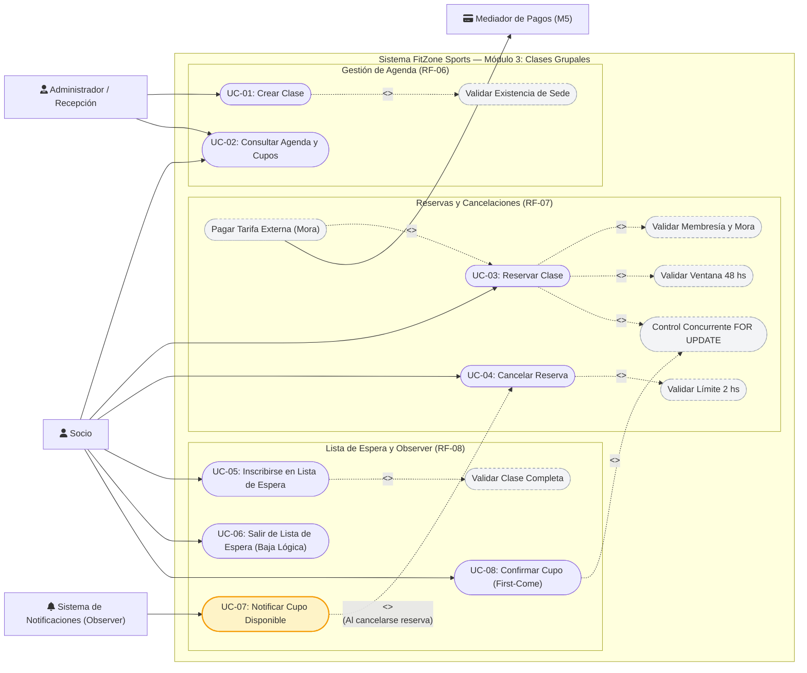

# Diagrama de Casos de Uso — Módulo 3: Clases Grupales (RF-06, RF-07, RF-08)

> **FitZone Sports — Documentación de Ingeniería del Software**  
> **Ubicación:** `docs/UserCaseDiagrams/`  
> **Módulo:** M3 Clases Grupales (Agenda, Reservas y Lista de Espera)  
> **Autores:** Santiago Rayn (desarrollador) + Gonzalo Vila (Pair Programming)

---

## 1. Diagrama General de Casos de Uso (UML)

---

## 2. Matriz de Trazabilidad: Actores vs Casos de Uso

| Actor | Caso de Uso | Requisito Funcional / Regla de Negocio | Descripción Breve |
| :--- | :--- | :--- | :--- |
| **Administrador / Recepción** | **UC-01: Crear Clase** | RF-06 | Da de alta una clase con instructor, horario, tipo y capacidad máxima. Valida la sede en M2. |
| **Socio / Visitante** | **UC-02: Consultar Agenda y Cupos** | RF-06 | Lista clases con filtros por sede, fecha y tipo; visualiza cupos disponibles en tiempo real. |
| **Socio** | **UC-03: Reservar Clase** | RF-07, Consistencia, Mora | Reserva lugar con hasta 48 hs de antelación. Bloquea cupo con lock pesimista. Valida cuota al día. |
| **Socio** | **UC-04: Cancelar Reserva** | RF-07 (Cancelación 2 hs) | Cancela la reserva sin penalidad hasta 2 hs antes. Libera el cupo y dispara evento Observer. |
| **Socio** | **UC-05: Inscribirse en Lista de Espera** | RF-08 | Si la clase está completa, el socio se anota en lista de espera (`EN_ESPERA`). |
| **Socio** | **UC-06: Salir de Lista de Espera** | RF-08 (Baja Lógica) | Se da de baja voluntariamente de la lista de espera pasando su estado a `CANCELADO`. |
| **Sistema (Observer)** | **UC-07: Notificar Cupo Disponible** | RF-08 (Patrón Observer) | Al liberarse un lugar, el observador actualiza a todos los anotados a `NOTIFICADO` y los alerta. |
| **Socio** | **UC-08: Confirmar Cupo (First-Come)** | RF-08 (Confirmación) | El primer socio notificado que confirme la reserva toma el cupo con lock pesimista de fila. |
| **Mediador de Pagos (M5)** | **UC-03 (Extensión): Pago Tarifa Externa** | Regla de Mora | Procesa el cobro de la clase a precio sin descuento si el socio está en mora. |

---

## 3. Especificación Detallada de los Casos de Uso Críticos

### UC-03: Reservar Clase
- **Actor Principal:** Socio.
- **Precondiciones:**
  1. El socio debe existir y estar autenticado.
  2. La clase debe existir y encontrarse programada para dentro de las próximas 48 horas (`now >= horario - 48h`).
  3. El socio no debe tener una reserva confirmada previa en la misma clase.
- **Flujo Principal:**
  1. El socio solicita la reserva de la clase indicando su `socio_id`.
  2. El sistema consulta a `MEMBERSHIP_VALIDATION_PORT` la vigencia de la membresía del socio.
  3. El sistema valida que la clase comience en un plazo menor o igual a 48 hs.
  4. El sistema inicia una transacción de base de datos y adquiere un lock pesimista sobre la clase (`SELECT ... FOR UPDATE`).
  5. El sistema verifica que la cantidad de reservas confirmadas sea menor a la capacidad de la clase.
  6. El sistema crea el registro `ReservaClase` con estado `CONFIRMADA`.
  7. El sistema confirma la transacción y retorna código `201 Created` con la cabecera `Location`.
- **Flujos Alternativos:**
  - **3a. Socio en Mora:** Si la membresía está vencida o suspendida, el sistema rechaza la reserva bonificada con `403 Forbidden` (`socio-en-mora`), invitando a pagar la tarifa externa vía el Mediador M5.
  - **3b. Reserva Anticipada:** Si faltan más de 48 hs para la clase, el sistema rechaza con `422 Unprocessable Entity` (`reserva-anticipada-no-permitida`).
  - **3c. Cupo Agotado:** Si la clase ya completó su capacidad, el sistema rechaza con `409 Conflict` (`cupo-agotado`), habilitando la inscripción en lista de espera (UC-05).
  - **3d. Reserva Duplicada:** Si el socio ya posee una reserva confirmada para la misma clase, se rechaza con `409 Conflict` (`reserva-duplicada`).

---

### UC-04: Cancelar Reserva de Clase
- **Actor Principal:** Socio.
- **Precondiciones:**
  1. Debe existir una reserva confirmada activa para el socio.
- **Flujo Principal:**
  1. El socio solicita la cancelación de su reserva.
  2. El sistema verifica la fecha y hora de la clase: comprueba que falten al menos 2 horas para su inicio (`now <= horario - 2h`).
  3. El sistema actualiza el estado de la reserva a `CANCELADA`.
  4. El sistema dispara el evento de dominio `CupoLiberadoEvent` hacia el `CupoLiberadoSubject` (Patrón Observer).
  5. El sistema responde `204 No Content`.
- **Flujos Alternativos:**
  - **2a. Cancelación Fuera de Término:** Si faltan menos de 2 horas para el inicio de la clase, el sistema rechaza la cancelación sin penalidad respondiendo `409 Conflict` (`cancelacion-fuera-de-termino`).

---

### UC-07: Notificar Cupo Disponible (Patrón Observer)
- **Actor:** Sistema de Notificaciones (Observer).
- **Disparador:** Ocurrencia del evento `CupoLiberadoEvent` al completarse exitosamente UC-04.
- **Flujo Principal:**
  1. El `CupoLiberadoSubject` recibe el evento con el identificador de la clase y la hora.
  2. El observador concreto `NotificarSociosEsperaObserver` consulta en la base de datos todos los socios con solicitudes en estado `EN_ESPERA` para dicha clase.
  3. Si existen socios en espera, el observador actualiza sus registros a `NOTIFICADO` y asigna `fecha_notificacion = now()`.
  4. El observador envía las alertas correspondientes (email/push/SMS stub) indicando que hay una vacante disponible bajo modalidad *first-come*.

---

### UC-08: Confirmar Cupo de Lista de Espera (First-Come)
- **Actor Principal:** Socio notificado.
- **Precondiciones:**
  1. La solicitud de lista de espera del socio debe encontrarse en estado `NOTIFICADO`.
- **Flujo Principal:**
  1. El socio notificado envía solicitud de confirmación del cupo.
  2. El sistema abre una transacción con lock pesimista (`SELECT ... FOR UPDATE`) sobre la clase.
  3. El sistema verifica si aún existe al menos un lugar libre (`reservas_confirmadas < capacidad`).
  4. El sistema actualiza la fila de `EsperaClase` a `CONFIRMADO` con `fecha_confirmacion = now()`.
  5. El sistema genera la `ReservaClase` en estado `CONFIRMADA`.
  6. La transacción se confirma y el sistema responde `204 No Content`.
- **Flujos Alternativos:**
  - **3a. Cupo Ganado por Otro Socio:** Si otro socio confirmó milisegundos antes y completó el aforo, el sistema rechaza con `409 Conflict` (`cupo-tomado`).
  - **1a. Solicitud no Notificada:** Si el socio intenta confirmar sin haber sido notificado previamente, responde `409 Conflict` (`espera-no-notificada`).
